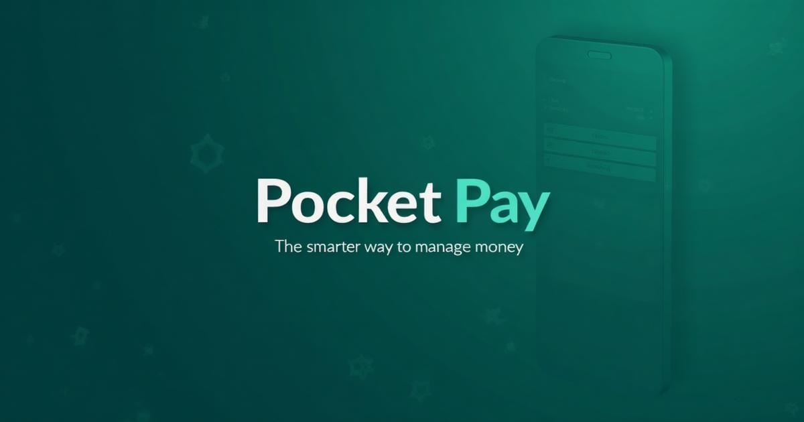

# Pocket Pay

A modern, mobile-first digital wallet application built with React, TypeScript, and Supabase.



## Features

- 💸 **Send & Receive Money** - Instant P2P transfers with QR code support
- 💳 **Virtual Cards** - Generate and manage virtual debit cards
- 🏦 **Bank Integration** - Deposit and withdraw with simulated bank accounts
- 📊 **Insights** - Spending analytics and transaction history
- 🛡️ **Smart Security** - Rule-based risk detection with user-friendly confirmation flows
- 📱 **Mobile-First** - Optimized for mobile devices with premium animations

## Tech Stack

- **Frontend**: React 18, TypeScript, Vite
- **Styling**: Tailwind CSS, shadcn/ui
- **Backend**: Supabase (PostgreSQL, Edge Functions, Auth)
- **State Management**: TanStack Query
- **Animations**: Framer Motion

## Getting Started

### Prerequisites

- Node.js 18+ 
- npm or bun

### Installation

```bash
# Clone the repository
git clone <YOUR_GIT_URL>

# Navigate to project directory
cd pocket-pay

# Install dependencies
npm install

# Start development server
npm run dev
```

### Environment Variables

Create a `.env` file with:

```env
VITE_SUPABASE_URL=your_supabase_url
VITE_SUPABASE_PUBLISHABLE_KEY=your_supabase_anon_key
```

## Project Structure

```
src/
├── components/
│   ├── screens/          # Main app screens
│   ├── navigation/       # Navigation components
│   ├── ui/               # shadcn/ui components
│   └── wallet/           # Wallet-specific components
├── hooks/                # Custom React hooks
├── services/             # API service layer
├── types/                # TypeScript types
└── pages/                # Route pages

supabase/
└── functions/            # Edge Functions
    ├── wallet/           # Balance, lookup
    ├── transfers/        # Send money
    ├── requests/         # Money requests
    ├── transactions/     # History, insights
    ├── cards/            # Virtual cards
    └── banking/          # Deposit/withdraw

docs/
├── BACKEND_DOCUMENTATION.md    # API documentation
└── BACKEND_REFERENCE_PYTHON.md # Python migration guide
```

## Architecture

### Ledger-Based Accounting

Wallet balances are calculated from an append-only ledger, not stored directly. This ensures:
- Complete audit trail
- Data integrity
- Easy reconciliation

### Payment Intent Pattern

Transactions represent the *intent* to move money. Actual balance changes only occur when ledger entries are created, enabling:
- Multi-step confirmation flows
- Risk rule evaluation
- Cancellation before completion

### Risk Rules

Transfers are automatically flagged for confirmation if:
- Amount exceeds $500
- First transfer to a new recipient  
- 5+ transfers in 60 minutes

## API Documentation

See [BACKEND_DOCUMENTATION.md](docs/BACKEND_DOCUMENTATION.md) for complete API reference.

## Contributing

1. Fork the repository
2. Create a feature branch (`git checkout -b feature/amazing-feature`)
3. Commit your changes (`git commit -m 'Add amazing feature'`)
4. Push to the branch (`git push origin feature/amazing-feature`)
5. Open a Pull Request

## License

This project is licensed under the MIT License.
